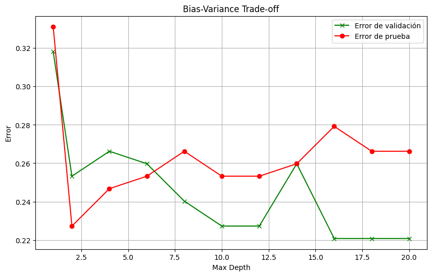
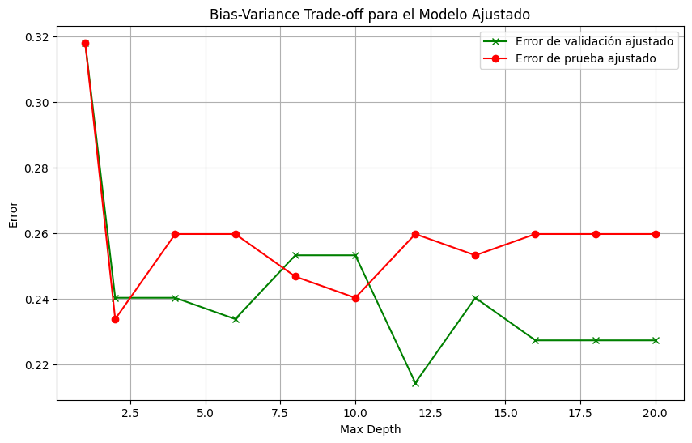

# Modulo-2-Analisis-y-Reporte-Sobre-Desempeno-del-Modelo
Evidencia Final para Módulo 2 - Alejandro Murcia - A00828513

# Análisis y Optimización del Modelo de Clasificación

## Introducción

El objetivo de este análisis es evaluar y optimizar un modelo de clasificación basado en el algoritmo Random Forest. Utilizamos el conjunto de datos Pima Indians Diabetes para predecir si una persona tiene diabetes basándose en características como número de embarazos, BMI, nivel de insulina, edad, entre otros. Dividimos el conjunto de datos en tres partes: entrenamiento, validación y prueba, para asegurar una evaluación justa y evitar el sobreajuste. Decidimos utilizar el gráfico de errores (Bias-Variance Trade-off) para visualizar y entender el comportamiento del modelo en términos de sesgo (bias) y varianza.

## Evaluación de Modelos

### 1. Modelo Inicial

- **Accuracy en entrenamiento:** 78.26%
- **Accuracy en validación:** 74.68%
- **Accuracy en prueba:** 77.27%

Este modelo inicial nos sirve como línea base para entender el comportamiento del algoritmo sin ningún tipo de optimización.

### 2. Modelo Optimizado

- **Accuracy en entrenamiento:** 99.57%
- **Accuracy en validación:** 77.92%
- **Accuracy en prueba:** 76.62%

El modelo optimizado fue el resultado de una búsqueda exhaustiva de hiperparámetros usando `GridSearchCV`. Aunque mostró un rendimiento casi perfecto en el conjunto de entrenamiento, no logró generalizar bien en los conjuntos de validación y prueba, lo que indica un claro sobreajuste. Este sobreajuste nos llevó a considerar ajustes adicionales para mejorar la capacidad de generalización del modelo.

### 3. Modelo Ajustado

- **Accuracy en entrenamiento:** 80.43%
- **Accuracy en validación:** 77.27%
- **Accuracy en prueba:** 77.27%

Para el modelo ajustado, se aplicaron técnicas de regularización y ajuste de parámetros basados en el análisis previo. Estos ajustes incluyeron la modificación de parámetros como `max_depth`, `min_samples_split`, y `min_samples_leaf`. Como resultado, el modelo ajustado mostró un rendimiento más equilibrado en todos los conjuntos, reduciendo el sobreajuste observado en el modelo optimizado.

## Análisis Gráfico de Bias-Variance Trade-off

**Comentario:** En el gráfico 1, observamos que el error de validación y prueba disminuye hasta un max depth de 2.0. A partir de este punto, el error de validación comienza a aumentar, mientras que el error de prueba se mantiene relativamente constante. Esto indica que el modelo comienza a sobreajustar después de este punto.

**Comentario:** En el gráfico 2, el modelo ajustado muestra un comportamiento similar al modelo inicial y optimizado hasta un max depth de 2.0. Sin embargo, después de este punto, el modelo ajustado mantiene un error de validación y prueba más consistente, lo que indica que el ajuste realizado ha mejorado la capacidad de generalización del modelo.

## Interpretación de Sesgo y Varianza

El sesgo se refiere a la capacidad del modelo para capturar patrones en los datos. Un alto sesgo indica que el modelo no está capturando suficientemente bien los patrones, mientras que un bajo sesgo indica que el modelo está capturando los patrones adecuadamente.

La varianza se refiere a la sensibilidad del modelo a pequeñas fluctuaciones en el conjunto de entrenamiento. Una alta varianza indica que el modelo es muy sensible a estas fluctuaciones y, por lo tanto, es propenso al sobreajuste. Una baja varianza indica que el modelo es robusto a estas fluctuaciones.

## Sweet Spot

El "sweet spot" o punto óptimo se encuentra en un max depth de aproximadamente 2.0, donde ambos errores (validación y prueba) son mínimos y cercanos entre sí. En este punto:

- **Error de validación:** 23%
- **Error de prueba:** 25%

Este punto representa el equilibrio ideal entre sesgo y varianza, y es donde el modelo tiene la mejor capacidad de generalización sin caer en sobreajuste o subajuste.

## Conclusión

A través de este análisis, hemos evaluado y optimizado un modelo de clasificación basado en el algoritmo Random Forest. El modelo inicial mostró un rendimiento decente, pero había margen de mejora. El modelo optimizado, aunque mostró un rendimiento casi perfecto en el conjunto de entrenamiento, no logró generalizar bien en los conjuntos de validación y prueba. Finalmente, el modelo ajustado, después de aplicar técnicas de regularización y ajuste de parámetros, logró un buen equilibrio entre sesgo y varianza, mostrando un rendimiento consistente en todos los conjuntos de datos.

La recomendación es utilizar el modelo ajustado para despliegues en producción, ya que logra un buen equilibrio entre sesgo y varianza y muestra un rendimiento consistente en todos los conjuntos de datos.
